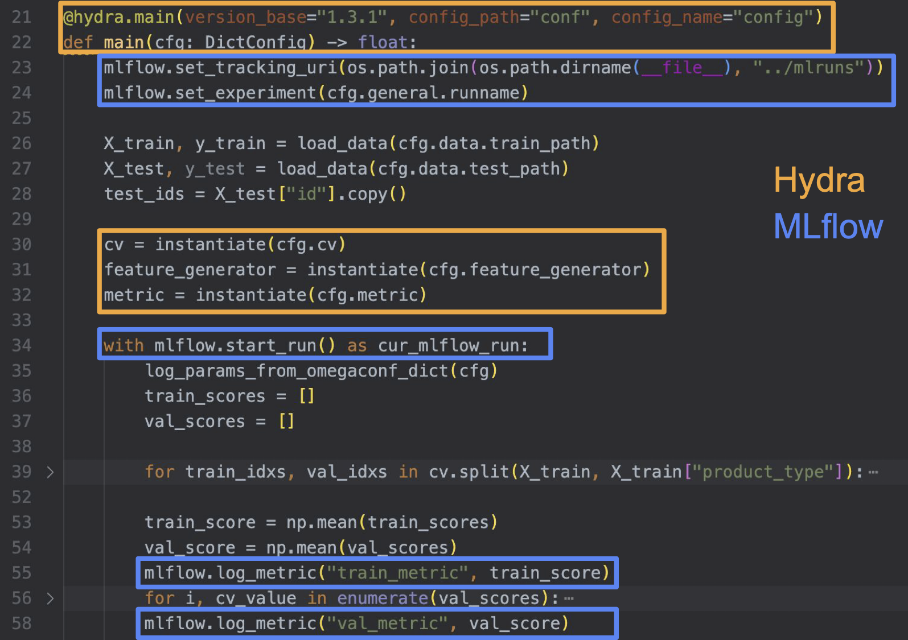

#### Отчет по [соревнованию предсказания оценки стоимости недвижимости](https://www.kaggle.com/competitions/aim2023-guess-the-price/overview)

## Инструкция по запуску

1. ```pip install -r requirements.txt```

2. ```python src/train.py -m```

После этого запустится процесс подбора гиперпараметров с помощью optuna, результаты которого можно будет наблюдать через UI mlflow, который будет доступен на [127.0.0.1](http://127.0.0.1:5050) после команды:

3. ```mlflow ui --port 5050```

## Описание решения

 - #### Выбор модели
 
    Т.к. данные в задаче были табличными, то в качестве моеделей было решено использовать бустинги. Вначале пробовал LGBM, потом пересел на CatBoost, стало получше. При подборе гиперпараметров оптимизировал число деревьев, глубину, lr, к-т регуляризации (конфиги со значениями гиперпараметров лежат [здесь](src/conf/search_space/)). В соревновании использовалась метрика RMSLE, но при обучении моделей метрику менять не пробовал.
 
 - #### Предобработка данных
    
    Предобработка данных заключалась в исключении колонок `id`, `timestamp`, добавлении признака возраста дома, и замене выбросов среди значений признаков на `nan`'ы. Код, отвечающий за преобработку данных, находится [здесь](src/data/feature_engineering.py).
    
 - #### Валидация
 
    Т.к. для данных в задаче была явно указана временная шкала, и в тестовые данных находились объекты с более поздним значением времени, то было решено использовать аналогичную схему валидации. Для этого были реализованы две схемы валидации - с увеличивающимся, и с постоянным размером train set. Размер val set старался устанавливать таким, чтобы на валидации отношение размера тренировочных данным к тестовым сохранялось таким же, как при формировании сабмита. В целом в плане корреляции значения метрики на валидации и public score разницы между двумя вышеописанными подходами не заметил, но все равно картина была лучше, чем при использовании обычной кросс-валидации. Код, отвечающий за валидацию, находится [здесь](src/validation/timeline_val.py).
 
 - #### Формирование финального сабмита
    
    Для формирования финального сабмита я взял три лучших по public score сабмита и усреднил их, за счет чего удалось немного улучшить значение public score, и также, как оказалось, улучшить значение private score.

## Описание пайплайна

Для проведения и управлением экспериментами использовалась связка из [Hydra](https://hydra.cc), [Optuna](https://optuna.org) и [MLflow](https://mlflow.org).

 - Hydra использовалась для управлением конфигурацией экспериментов


 - MLflow использовался для выбора модели для сабмита и анализа значений гиперпараметров


